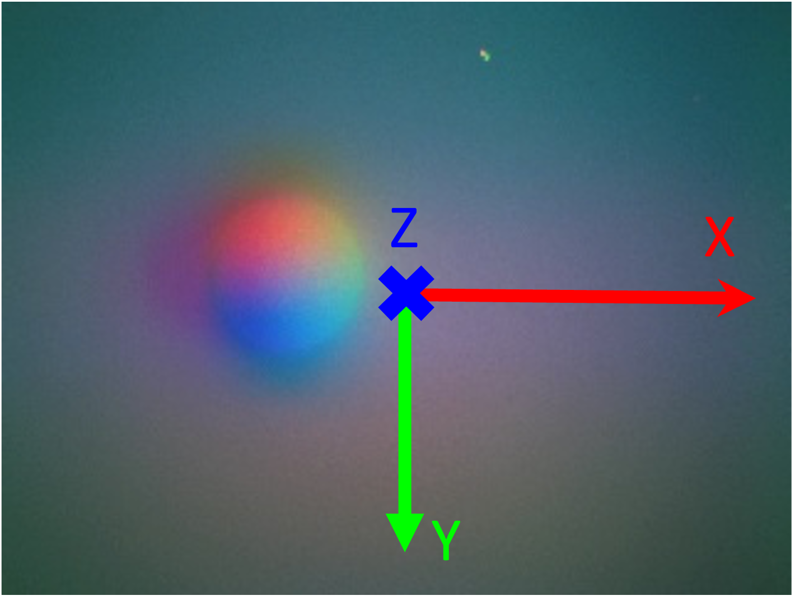
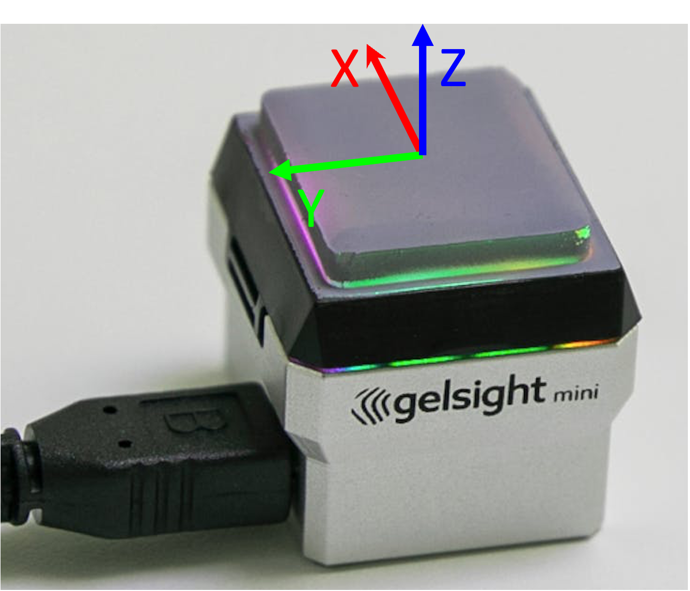

# GelSight SDK
[](https://www.gnu.org/licenses/gpl-3.0) &nbsp;[](https://rpl.ri.cmu.edu/)

This repository is a modified version of the [the official gsrobotics implementation](https://github.com/gelsightinc/gsrobotics), offering improvements in usability and sensor compatibility.

## Key Features

- **Sensor Calibration**: Added functionality for users to calibrate their own GelSight sensors.

- **Expanded Sensor Compatibility**: Compatible with other GelSight sensors, including Digit and lab-made sensors.

- **Low-Latency Sensor Reading**: Including an enhanced image streaming pipeline for reduced latency and frame drop, especially for GelSight Mini.

Authors:
* [Hung-Jui Huang](https://joehjhuang.github.io/) (hungjuih@andrew.cmu.edu)
* Ruihan Gao (ruihang@andrew.cmu.edu)

## Support System
* Tested on Ubuntu 22.04
* Tested on GelSight Mini and Digit
* Python >= 3.9

## Installation
Clone and install gs_sdk from source:
```bash
git clone git@github.com:joehjhuang/gs_sdk.git
cd gs_sdk
pip install -e .
```

## Coordinate Conventions
The coordinate system convention in this SDK is shown below, using the GelSight Mini sensor for illustration:

| 2D (sensor image)                           | 3D                         |
| --------------------------------- | --------------------------------- |
|   |     |

## Sensor Calibration
For more details on sensor calibration, see the [Calibration README](calibration/README.md).

## Examples
These examples show basic usage of this GelSight SDK.
### Sensor Streaming
Stream images from a connected GelSight Mini:
```python
python examples/stream_device.py
```

### Low Latency Sensor Streaming
Stream images with low latency and without frame dropping from a connected GelSight Mini:
```python
python examples/fast_stream_device.py
```

### Reconstruct Touched Surface
Reconstruct a touched surface using the calibration model. Calibration steps are detailed in the [Calibration README](calibration/README.md).
```python
python examples/reconstruct.py
```
The reconstructed surface will be displayed and saved in `examples/data`.