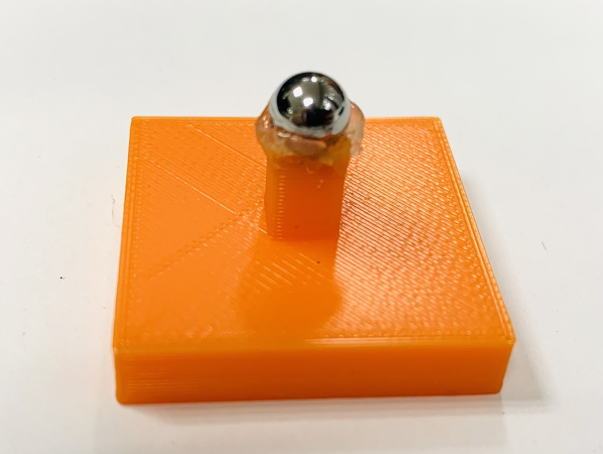
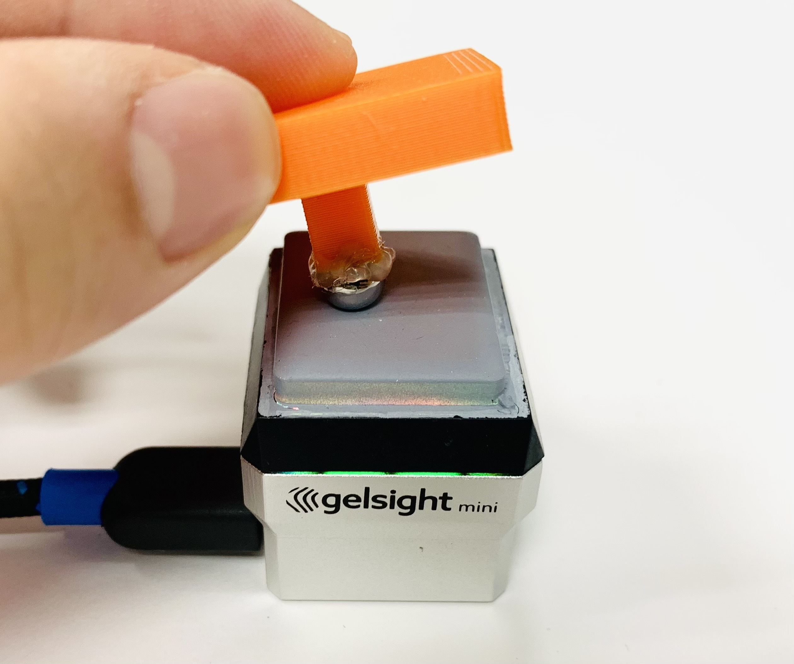
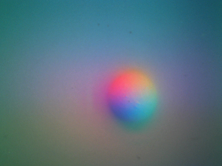
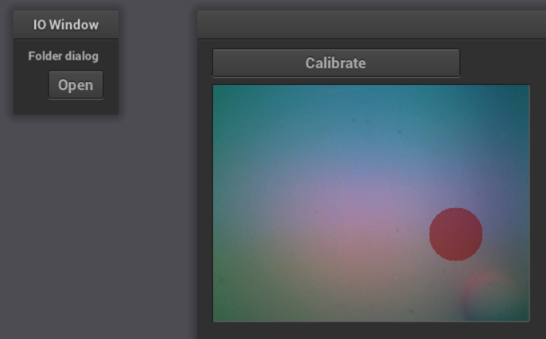

## Sensor Calibration
We provide calibration tools for new GelSight sensors, following the method described in [1]; the process generally takes less than an hour. For lab-made sensors, refer to `examples/configs/gsmini.yaml` to create a sensor specification, which will be used as the `CONFIG_PATH` in the command below. Below are step-by-step instructions for sensor calibration. **Note: The current version does not support gel pads with markers.**
### Calibration Data Collection
| Ball Indenter | Collecting Data | Collected Image |
|---------|---------|---------|
|   |   |   |

To collect calibration data, use a ball indenter of known diameter to press against the sensor. Examples of the setup and resulting images are shown above. Run the following command and allocate a location `CALIB_DIR` to save the calibration data:
```bash
collect_data [-b CALIB_DIR] [-d BALL_DIAMETER_IN_MM] [-c CONFIG_PATH]
```
* Instruction:
  * Save background image: Press 'b'
  * Capture ~50 tactile images by pressing the ball in various locations: Press 'w'
  * Exit: Press 'q'
* Tips for Optimal Calibration:
  * Ball Size: Select a ball that appears well-sized within the sensor’s view, like the tactile image shown above; 4mm to 9mm is suitable for GelSight Mini.
  * Pressure: Avoid pressing too hard.
  * Coverage: Capture at least 50 images with the ball contacting different regions of the sensor.
  * Using Multiple Balls: Use the same `CALIB_DIR` and specify distinct `BALL_DIAMETER` values if balls in different size are applied.

### Label Collected Data
| NanoGui Screenshot |
|---------|
|   |

Run the command below to label the contact circle on the collected tactile data using NanoGUI:

```bash
label_data [-b CALIB_DIR] [-c CONFIG_PATH]
```
* Instruction:
  * Click the **Open** icon to begin.
  * Keyboard Controls for aligning the label with the contact circle:
    * **Arrow keys (left/right/up/down)**: Adjust the circle's position.
    * **'m' / 'p'**: Decrease / increase the circle's radius.
    * **'f' / 'c'**: Decrease / increase the circle's movement step.
  * Once aligned, click the **Calibrate** icon.
  * After labeling all data, close the window to exit.

### Prepare Dataset
Run the command below to prepare the dataset for calibration model training:
```bash
prepare_data [-b CALIB_DIR] [-c CONFIG_PATH]
```

### Train Calibration Model
Train the MLP model to map pixel color and location (RGBXY) to surface gradients for each pixel. Use the following command to train the model with the collected dataset:
```bash
train_model [-b CALIB_DIR] [-d {cpu|cuda}]
```

The trained model is saved in `CALIB_DIR/model/nnmodel.pth`.

## Test the Trained Calibration Model
Once the model is trained, connect the sensor and run the following command to stream images and perform real-time surface reconstruction using the trained calibration model:

```bash
test_model [-b CALIB_DIR] [-c CONFIG_PATH]
```
After starting, wait briefly for background data collection; real-time surface gradient predictions will then be displayed. Press any key to exit.


### References
1. S. Wang, Y. She, B. Romero, and E. H. Adelson, “Gelsight wedge:
Measuring high-resolution 3d contact geometry with a compact robot
finger,” in 2021 IEEE International Conference on Robotics and
Automation (ICRA). IEEE, 2021.